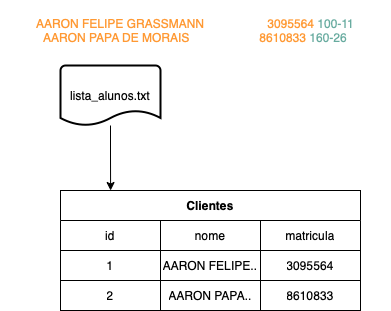
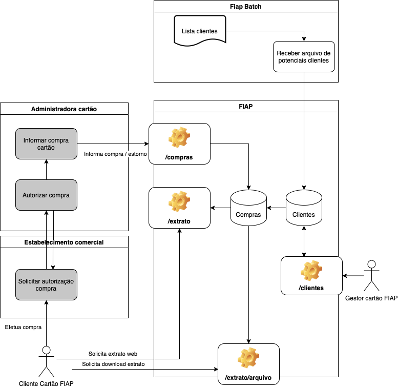
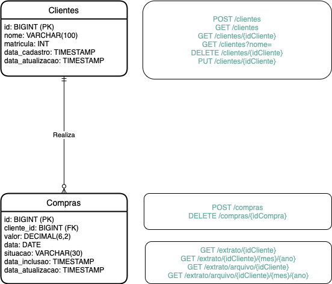

# Cartão FIAP 

## 🎯 Objetivo

Trata-se de um sistema para gerenciar movimentação e cadastramento de alunos que possuem cartões FIAP. 

## 📐 Projeto da aplicação

A aplicação está dividida em dois repositórios no GITHUB: 

1) [Aplicação Spring Batch](https://github.com/AlexDamiao86/CartaoFiapBatch.git) - Realiza carregamento de dados iniciais dos possíveis clientes do cartão FIAP. 

- A aplicação irá ler o arquivo lista_alunos.txt que está na pasta src/main/resources/lista_alunos.txt. Os dados de nome e matrícula do aluno contidos neste arquivo serão persistidos na tabela CLIENTES.

> **_NOTA 1:_** Essa aplicação deverá ser executada antes da aplicação web para popular a tabela CLIENTES.

> **_NOTA 2:_** Cada execução dessa aplicação irá adicionar novamente os clientes do arquivo lista_alunos.txt

2) [Aplicação Spring Boot Web](https://github.com/AlexDamiao86/CartaoFiap.git) - Disponibiliza endpoints para manutenção de cadastro de clientes, recebimento de transações realizadas nos cartões, consulta extratos dos cartões. 

- Após iniciar a aplicação será possível interagir com ela através do [Swagger](http://localhost:8081/swagger-ui/index.html#/). Veja pela documentação Swagger os dados de requsição e resposta das operações disponibilizadas. 

#### Visão Geral

#### Modelo Entidade Relacionamento (Endpoints)

> **_NOTA 3:_** A cada execução dessa aplicação nova massa de teste de transações é adicionada -- 15.000 registros de transações autorizadas para clientes com identificador entre 1.000 e 3.000 com data de compra entre 01/01/2022 e 17/07/2022. 

> **_NOTA 4:_** Para ser possível manter a integridade com a tabela CLIENTES é necessário executar primeiramente a [aplicação Batch](#batch)

## 🛠️ Tecnologias utilizadas

- Linguagem Java (versão 11)
- [Spring Framework](https://spring.io)
  - [Spring Initializr](https://start.spring.io)
  - [Spring Data JPA](https://spring.io/projects/spring-data-jpa)
  - [Spring Boot Web](https://spring.io/projects/spring-boot)
  - [Spring Batch](https://spring.io/projects/spring-batch)
  - [Spring REST Doc](https://spring.io/projects/spring-restdocs)
- [Gradle (Gerenciador de dependências)](https://gradle.org)
- [Github (Controle de versão)](https://github.com)
- [H2](https://www.h2database.com)
- [Swagger](http://swagger.io)
- [Flyway](https://flywaydb.org)

## ⚙️ Como executar o projeto

> **_NOTA 5:_** (Apenas na primeira vez da execução) O banco de dados utilizado será o H2 e estará armazenado no seguinte caminho do computador ~/fiapdb/cartao-fiap. Se a pasta/arquivo já existirem, favor deletá-los antes de executar os próximos passos.

1. Clonar projeto Spring Batch do GitHub:
~~~bash
git clone https://github.com/AlexDamiao86/CartaoFiapBatch.git
~~~
2. Importar o projeto na sua IDE de preferência (atualizar o build.gradle). 
3. Executar o arquivo /src/main/java/CartaoBatchApplication.java.

4. Clonar projeto Spring Web do GitHub: 
~~~bash
git clone https://github.com/AlexDamiao86/CartaoFiap.git
~~~
5. Importar o projeto na sua IDE de preferência (atualizar o build.gradle). 
6. Executar o arquivo /src/main/java/CartaoApplication.java.

7. Interagir na aplicação através do [Swagger](http://localhost:8081/swagger-ui/index.html#/).
8. Possibilidade de visualizar os dados no [h2-console](http://localhost:8081/h2-console/).

> **_NOTA 6:_** Existe uma massa de testes relativamente grande tanto de CLIENTES como COMPRAS. A visualização dos dados da base no h2-console permite confirmar isso. Exemplo: Pode ser utilizado o identificador do cliente 1969 para consultar extrato no mês atual, no mês de 04/2022.

## 👨🏽‍💻 Desenvolvedores

| [ Alexandre Damião Mendonça Maia](https://github.com/AlexDamiao86) |  [ Fabio Ferreira dos Santos](https://github.com/FabioQuimico) |  [ Gabriel Oliveira Barbosa](https://github.com/Gabriel2503) | [ Rafael Braga da Silva Ferreira](https://github.com/ferreirabraga) | 
| :---: | :---: | :---: | :---: |

>
>Projeto realizado como requisito para conclusão da disciplina Spring do MBA Full Stack Development - FIAP 2022
>Prof. Fabio Tadashi Miyasato (https://github.com/fabiotadashi)
